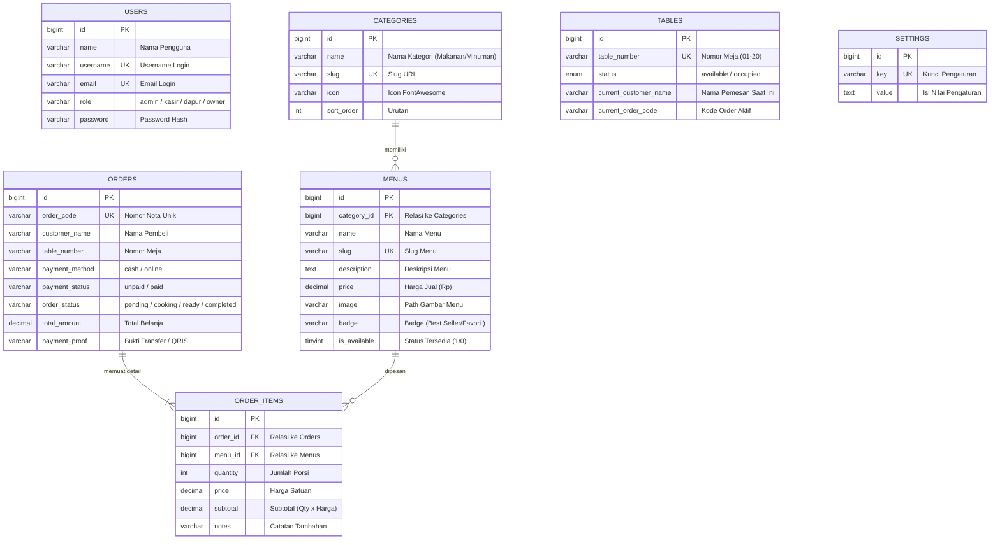

# DIAGRAM ERD & STRUKTUR TABEL DATABASE
## Sistem Kasir & Pemesanan Depot Sate Be Ba Lung

---

### 1. Diagram Relasi Entitas (ERD)

---

### 2. Penjelasan Relasi Antar Tabel:
1. **`categories` ke `menus` (One to Many)**:
   - Satu kategori (misal: "Menu Makanan") bisa memiliki banyak item menu (Sate, Tongseng, Sop, dll).
2. **`orders` ke `order_items` (One to Many)**:
   - Satu nomor transaksi order bisa memiliki banyak baris item pesanan. Jika order dihapus, item rinciannya ikut terhapus (*Cascade on Delete*).
3. **`menus` ke `order_items` (One to Many)**:
   - Satu jenis menu dapat dipesan berulang kali di berbagai transaksi order pelanggan.
